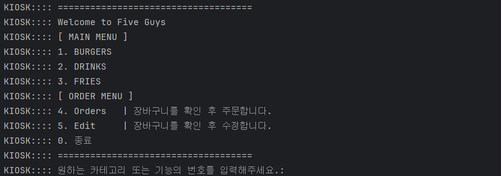
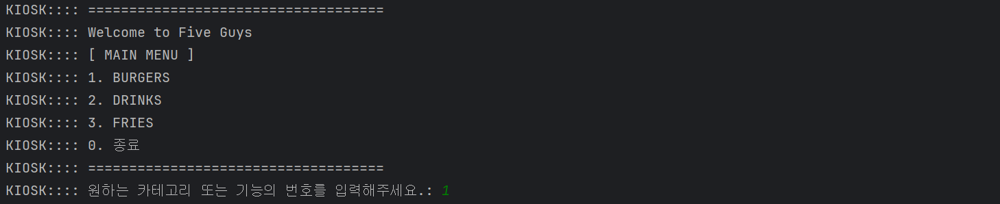
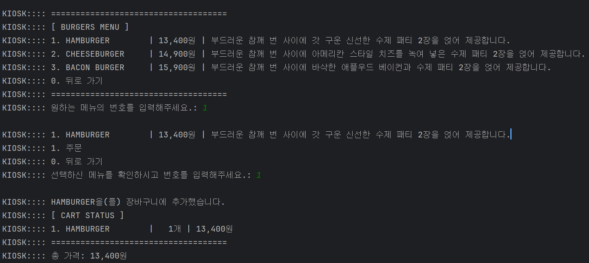
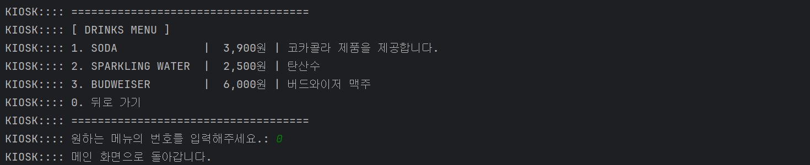
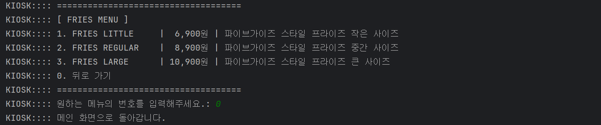
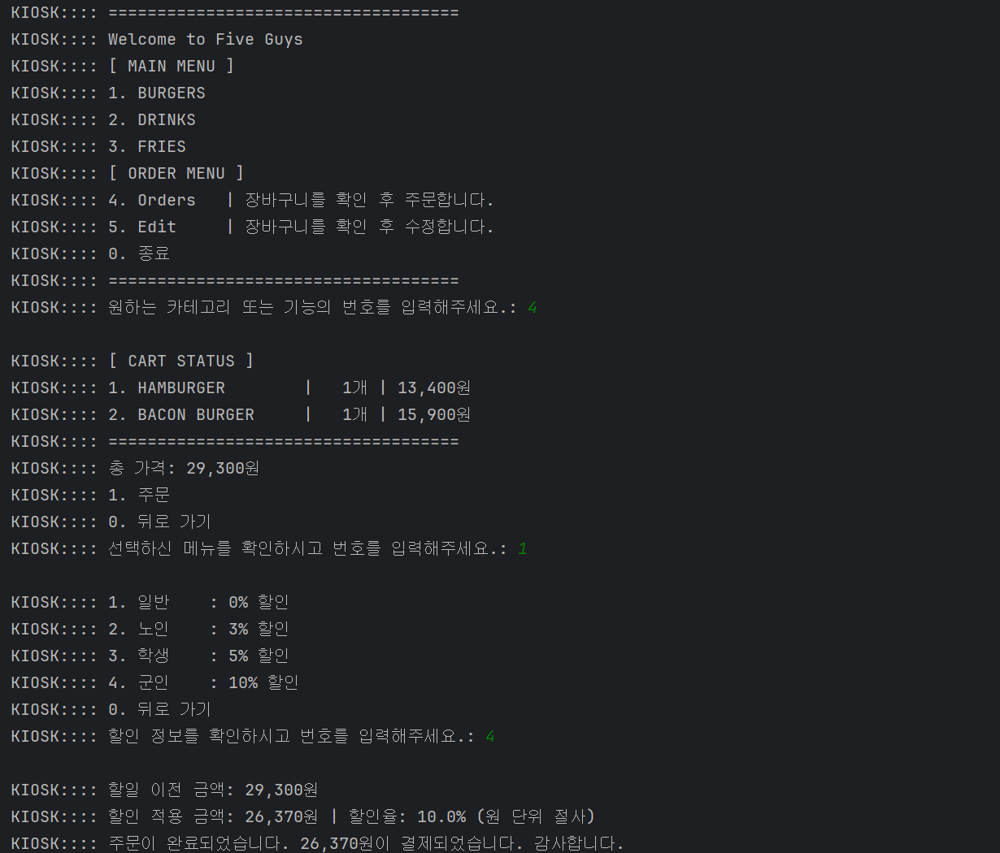
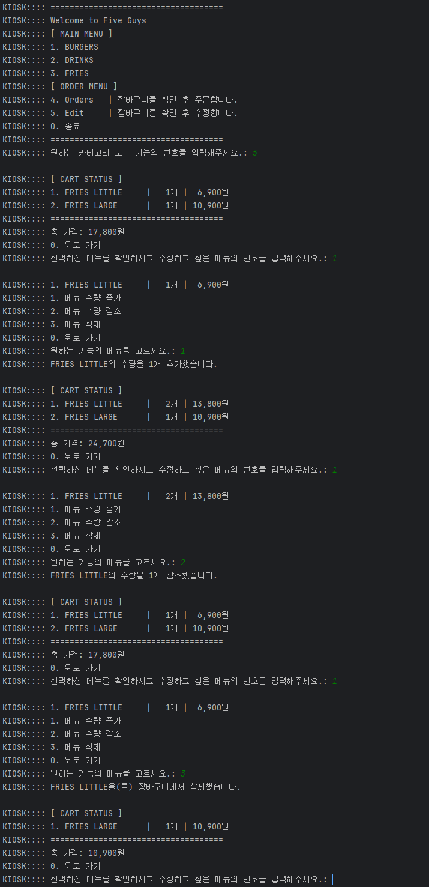

# 키오스크 README.md

# nbcamp-ch2-kiosk

내일배움캠프 Spring 8기 트랙 Chapter 2 키오스크 과제에 대한 리포지토리입니다.



## 1. 프로젝트 개요

- `Java`를 활용하여 `CLI`환경에서 동작하는 키오스크 개발 프로젝트입니다.
- 객체지향 프로그래밍을 이해하고 클래스의 역할과 책임에 집중하여 클래스 간의 관계를 설계하기 위해 노력했습니다.
- 모던 Java의 내용을 학습하고 적용하기 위해 노력했습니다.
- 콘솔로 입출력이 이루어지는 만큼 사용자 입장에서 여러 기능으로 인해 화면이 바뀌더라도, 화면을 쉽게 이해할 수 있도록 노력했습니다.
- 파이브가이즈 매장의 데이터를 사용했습니다.

## 2. 주요 기능 및 화면 소개

### 주요 기능

1. **사용자 입력 기반의 화면 흐름 관리**
    - 사용자 입력 → 화면 및 데이터 갱신
2. **상품 추가 기능**
    - 메뉴별 카테고리 및 상세 메뉴 확인
    - 선택한 메뉴아이템에 대한 장바구니 추가 전 확인 절차 존재
3. **주문 기능**
    - 장바구니에 담긴 상품과 총액 확인
    - 사용자 유형별 할인 정책 확인
    - 할인이 적용된 최종 금액 출력
4. **장바구니 기능**
    - 장바구니에 담긴 상품, 수량, 수량에 따른 가격 조회
    - 장바구니에 담긴 순서대로 확인 가능
    - 장바구니에 담긴 상품의 수량 추가, 감소 및 상품 삭제 가능

### 화면 소개



- **메인 메뉴**: 상품 카테고리 선택 및 장바구니 관련 메뉴 선택







- **상품 메뉴**: 카테고리별 상세 메뉴 조회 및 장바구니 추가 기능 제공



- **주문 메뉴**: 장바구니 조회 및 사용자 유형에 따른 차등 할인 적용 (장바구니에 아이템이 하나라도 존재해야 출력)



- **장바구니 수정 메뉴**: 장바구니에 존재하는 상품의 수량 변경, 삭제 기능 제공 (장바구니에 아이템이 하나라도 존재해야 출력)

## 3. 적용 기술

- **Language**: `Java 17`
- **Concepts**: `Object-Oriented Programming`, `State Machine Pattern`
- **APIs**: `Lambda & Stream API`, `Collections Framework (Map, List)`, `Enum`
- **Exception Handling**

## 4. 프로젝트 구조 및 실행 방법

### 프로젝트 구조

```java
📦nbcamp-ch2-kiosk
├─ .gitignore
├─ README.md
├─ build.gradle
├─ gradle
│  └─ wrapper
│     ├─ gradle-wrapper.jar
│     └─ gradle-wrapper.properties
├─ gradlew
├─ gradlew.bat
├─ settings.gradle
└─ src.main.java.io.github.seonrizee.kiosk
                     ├─ challenge // 도전 기능 구현 패키지
                     │  ├─ lv1
                     │  │  ├─ Cart.java
                     │  │  ├─ CartItem.java
                     │  │  ├─ Kiosk.java
                     │  │  ├─ Main.java
                     │  │  ├─ Menu.java
                     │  │  └─ MenuItem.java
                     │  └─ lv2 // 최종 버전
                     │     ├─ Main.java // Kiosk 실행 클래스
                     │     ├─ application // Kiosk 흐름 및 로직 제어 관련 패키지
                     │     │  ├─ Kiosk.java // Kiosk App 구현 클래스
                     │     │  ├─ Screen.java // Kiosk 화면 구현 Enum
                     │     │  └─ ScreenIntent.java // Kiosk 화면 전환에 사용되는 intent 클래스
                     │     ├─ domain // Kiosk 데이터 관련 패키지
                     │     │  ├─ Cart.java // 장바구니 구현 클래스
                     │     │  ├─ CartItem.java // 장바구니 아이템 구현 클래스
                     │     │  ├─ Discount.java // 할인 정책 구현 Enum
                     │     │  ├─ Menu.java // 메뉴 (카테고리) 구현 클래스
                     │     │  └─ MenuItem.java // 상세 메뉴 구현 클래스
                     │     └─ view // Kiosk 콘솔(View) 관련 패키지
                     │        └─ KioskConsole.java // Kiosk 콘솔 입출력 구현 클래스
                     └─ required // 필수 기능 구현 패키지
                        ├─ lv1
                        │  └─ Main.java
                        ├─ lv2
                        │  ├─ Main.java
                        │  └─ MenuItem.java
                        ├─ lv3
                        │  ├─ Kiosk.java
                        │  ├─ Main.java
                        │  └─ MenuItem.java
                        ├─ lv4
                        │  ├─ Kiosk.java
                        │  ├─ Main.java
                        │  ├─ Menu.java
                        │  └─ MenuItem.java
                        └─ lv5
                           ├─ Kiosk.java
                           ├─ Main.java
                           ├─ Menu.java
                           └─ MenuItem.java
```

- `kiosk` 패키지에서 `challenge`(도전 기능), `required`(필수 기능) 2개의 패키지 존재
- 각 패키지마다 Level 단계별로 패키지 생성하여 구현

### 실행 방법

- **Java 17** 사용 권장
- 필요한 별도의 의존성 없음
- 단계별 실행 방법
    - **도전 기능 Lv 2. Enum, 람다 & 스트림을 활용한 주문 및 장바구니 관리 (최종 버전)**

      → src/~/challenge/lv2/Main.java Main 메소드 실행

    - 도전 기능 Lv 1. 장바구니 및 구매하기 기능을 추가하기

      → src/~/challenge/lv1/Main.java Main 메소드 실행

    - 필수 기능
        - 필수 기능 Lv 5. 캡슐화 적용하기

          → src/~/required/lv5/Main.java Main 메소드 실행

        - 필수 기능 Lv 4. 객체 지향 설계를 적용해 음식 메뉴와 주문 내역을 클래스 기반으로 관리하기

          → src/~/required/lv4/Main.java Main 메소드 실행

        - 필수 기능 Lv 3. 객체 지향 설계를 적용해 순서 제어를 클래스로 관리하기

          → src/~/required/lv3/Main.java Main 메소드 실행

        - 필수 기능 Lv 2. 객체 지향 설계를 적용해 햄버거 메뉴를 클래스로 관리하기

          → src/~/required/lv2/Main.java Main 메소드 실행

        - 필수 기능 Lv 1. 기본적인 키오스크를 프로그래밍해보자

          → src/~/required/lv1/Main.java Main 메소드 실행

## 5. 주요 설계 및 트러블 슈팅

### 필수 기능

[필수 기능 회고](https://seonrizee.github.io/blog/2025-07-21-ch2-kiosk-required/)

- **List**<**Menu**> **MenuList를 어디서 생성하고 어디서 주입해야할까?**
    - 객체 생성시 외부에서 주입
- **MenuItem을 목록에서 선택 후 머무르기 vs. 돌아가기**
    - 같은 카테고리의 다른 상품을 담을 수 있도록 머무르기
- **List.copyOf, unmodifiableList, new ArrayList의 차이**
    - 각 방법의 차이를 이해하고 사용하기
- **총액 계산 시점의 선택: 수량이 변할 때마다 vs 필요할 때 한 번에**
    - 데이터 동기화와 계산 가격의 정확성을 고려하여 별도의 메소드를 통한 계산

### 도전 기능

[도전 기능 Level 1 회고](https://seonrizee.github.io/blog/2025-07-22-ch2-kiosk-challenge/)

- **장바구니에 적절한 콜렉션은?**
    - 순차조회, 순차출력, 추가, 삭제 성능을 고려하여 LinkedHashMap 사용
- **CartItem에 대한 책임은 누가 가져야 할까?**
    - 호출한 Kiosk는 내부 구현에 대해 알 필요가 없으므로 Cart에서 책임지도록 함
- **`increaseQuantity()`vs`updateQuantity(int amount)`답은 둘 다?**
    - 기획에 따라 상황을 고려하여 결정, 현재는 콘솔의 입출력 통일성을 위해 1개씩 수량 조절하도록 개발
- **장바구니의 내용을 업데이트하고 난 뒤 return은 필요할까?**
    - 상황에 따라 결정하며, 업데이트가 이뤄진 전체 객체 반환 및 boolean 형식의 값 사용
    - Level 2 리팩토링 과정에서는 boolean은 제거하고 업데이트에 실패하는 경우는 Exception으로 처리

[도전 기능 Level 2 회고](https://seonrizee.github.io/blog/2025-07-24-ch2-kiosk-challenge-2/)

- **복잡한 UI 흐름과 중첩된`while`:`Enum`과`Intent`객체로 Kiosk 제어 개선하기**
    - 입출력을 담당하는 `KioskConsole` 클래스 구현, 입력 메소드 추상화하여 구현
    - `Android`의 `Intent`에서 영감을 받음
    - 화면 상태를 나타내는 `Screen` Enum 구현
    - 사용자의 입력에 따라 다음 화면 및 데이터 전달 목적의 `ScreenIntent`객체 생성
    - 반환된 `ScreenIntent`에 따라 사용자가 선택한 화면 및 데이터 갱신
- **Discount Enum에서 어디까지 담당해야 할까? 데이터 제공 vs. 화면 그리기**
    - Enum에서는 데이터만 반환하고, 다른 클래스들에서 역할에 맞게 활용하도록 구현
- **패키지 구조 리팩토링**
    - 역할에 따라 `domain`,`application`,`view` 로 분리

## 6. 브랜치 전략 및 커밋 컨벤션

### **브랜치 전략**

- develop 브랜치 개발 → main 브랜치 PR 적용
- 별도의 git flow나 github flow같은 브랜치 전략은 1인 프로젝트 과제 편의상 사용하지 않음

### **커밋 컨벤션**

[**Conventional Commits 참고**](https://www.conventionalcommits.org/ko/v1.0.0/)

```yaml
feat: 새로운 기능 추가
fix: 버그 수정
refactor: 코드 리펙토링
docs: 문서 추가 및 수정
chore: code와 관련 없는 설정, 변경
```

## 7. 향후 개선 과제

1. `Order`(주문) 개념을 도입하여`Cart`와 분리
    - 장바구니에 담겨있는 상태와 할인까지 가격이 반영되어 계산이 이루어지는 상태는 엄연히 다르다고 생각합니다.
    - 주문 및 할인 정책을 반영한 가격 계산 기능을`Order`로 이전하는 것이 좋다고 생각합니다.
    - 가격이 반영되어 계산이 실제로 이루어진 데이터 관리를 대비하기 위한`Order`클래스 설계가 필요합니다.
2. `MenuItem`을 상속한 다양한 상품 카테고리 타입 사용
    - 메뉴의 카테고리 범주인 BURGERS, DRINKS, FRIES 모두 `MenuItem`으로 처리하고 있습니다.
    - 과제에서 개별 상품에 따른 별도의 기능이 없었지만, 확장성을 고려하면 `MenuItem`을 추상클래스로 만들고, 상속하여 각각의 클래스로 구현할 수 있습니다.
    - 이렇게 하면 BURGERS의 특정 재료 포함 여부나 DRINKS나 FRIES의 사이즈 등 메뉴마다 필요한 특성을 고유한 `field`로 규정하면서도, 공통적인 특성이나 기능은 상속받은 `field`나
      `method`를 활용하면서 객체지향의 특성을 살릴 수 있습니다.
3. `ScreentIntent`이 본래`Android`의 인텐트처럼 다양한 타입의 값 전달
    - 본문에서도 언급되어 있는 내용입니다.
    - 현재는 사용자가 선택한 기능의`int`형`index`만 전달합니다.
    - 차후 확장을 고려하여 여러 타입의 데이터를 활용할 수 있도록 확장이 필요합니다.
4. `view.KioskConsole`클래스의 출력 관련 메소드들 정리
    - 현재`printxxx()`,`displayxxx()`등 메소드명으로 구별이 되어 있지만 공통적인 부분이 여전히 존재합니다.
    - Kiosk에서 완전히 분리하지 못한 출력 청크들도 아직 존재하기에 추상화 및 모듈화를 진행할 수 있습니다.
    - `Generic`을 이용하면 담긴 아이템이 다른 List가 인자로 들어오더라도 비슷한 형식으로 출력하는 메소드들은 하나의 메소드로 처리할 수 있다고 생각합니다.
    - 사용 시 모듈화된 메소드를 조립하여 사용하도록 하여 재사용성을 높일 수 있습니다.
5. `View`인터페이스 도입을 통해`Kiosk`와의 결합도를 낮추기
    - 위에서 이어지는 것으로 콘솔 관련 메소드가`view.KioskConsole`로 모두 옮겨졌지만, 여전히 결합도가 높습니다.
    - 따라서 클라이언트의 개발 방법이 변경될 경우 `Kiosk`의 관련 코드를 모두 수정해야 하는데, 인터페이스를 도입하고 필수 구현 메소드를 정의하여 변경에 열려있도록 개선할 수 있다고 생각합니다.
